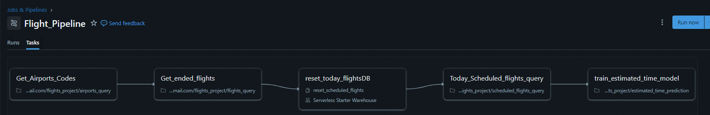

## 🛫 Costa Rica Flight Prediction Pipeline

-An end-to-end Data Engineering and Machine Learning pipeline built entirely on Databricks.  
This project orchestrates the collection of historical flight data, real-time scheduled flights in Costa Rica, and uses Machine Learning to predict arrival and departure delays.

---
## 🛠️ Tech Stack
- **Platform:** Databricks (Cloud Version)  
- **Orchestration:** Databricks Workflows (Jobs & Pipelines)  
- **Languages:** Python (PySpark / Pandas), SQL  
- **Storage:** Delta Lake  
- **Compute:** Serverless Starter Warehouse / Standard Clusters  
- **Visualization:** GitHub Pages (Custom Dashboard)  
---

## ⚙️ Pipeline Architecture

The pipeline (`Flight_Pipeline`) consists of **five main stages**:

### 1️⃣ Get_Airports_Codes
Fetches and updates the reference data for international and local airport codes relevant to the Costa Rican flight paths.

### 2️⃣ Get_ended_flights
Ingests historical data of completed flights. This serves as the **"Ground Truth"** for training predictive models.

### 3️⃣ reset_today_flightsDB
A maintenance task that: Cleans daily operational tables, Resets current-day data,Prevents duplicates in the dashboard  

### 4️⃣ Today_Scheduled_flights_query
Pulls real-time API/Source data for flights scheduled for the current date.

### 5️⃣ train_estimated_time_model
The **Machine Learning component**: Processes historical patterns trains/applies a predictive model,Predicts `estimated_time` for currently scheduled flights  

---
## 📊 Dashboard & Predictions
The output of this pipeline is consumed by a front-end dashboard where users can compare:
**Scheduled Time:** vs **Predicted Time:** 
---
## 🔗 Live Project Dashboard
[*DataBricks_Dashboard*](https://dixonjafet.github.io/Flight_Dashboard_DataBricks/)
